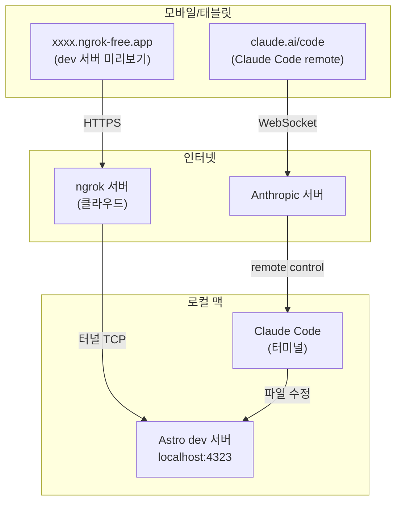

Astro로 블로그를 개발하면서 Claude Code를 주로 사용하고 있다. 태블릿에서도 개발해보고 싶었고, 몇 가지 방법을 시도해봤다.

## GitHub Codespaces

처음엔 GitHub Codespaces를 시도했다. 클라우드에서 개발 환경을 통째로 띄우는 방식이라 모바일에서도 브라우저만 있으면 된다. 다만 repo를 2개 운영하고 있고 Claude Code 설정도 별도로 관리하고 있어서, repo 단위로 독립 생성되는 Codespaces 구조가 맞지 않았다.

## ngrok

로컬 개발 서버를 그대로 띄우고 ngrok으로 외부에 노출하는 방식이다. 같은 Wi-Fi에서 `--host` 옵션으로 IP를 노출하는 방법도 있지만, ngrok은 어디서든 HTTPS URL 하나로 접근할 수 있다.

로컬 맥 터미널에서 `claude --remote-control`로 Claude Code를 실행하면, 모바일의 Claude 앱 또는 [claude.ai/code](https://claude.ai/code)에서 해당 세션에 원격으로 연결할 수 있다. ngrok 설치 및 실행도 Claude가 대신 처리해준다. 내가 접속한 방식을 그려달라고 했을 때 아래처럼 그려줬다.

## 실행 순서

1. **ngrok 설치** — [공식 설치 가이드](https://ngrok.com/docs/getting-started/) 참고 (`brew install ngrok` 기본)
2. **Claude Code remote control 켜기** — 로컬 터미널에서 `claude --remote-control` 실행
3. **Claude에게 dev 서버와 ngrok 연결 요청** — Claude가 `pnpm dev` 실행 후 `ngrok http <포트>` 까지 처리
4. **모바일에서 remote control 연결** — Claude 앱 또는 [claude.ai/code](https://claude.ai/code) 접속 후 세션 연결
5. **브라우저에서 ngrok 주소 접속** — Claude가 알려준 URL로 미리보기 확인

## 후기

Claude Code remote control은 생각보다 불편한 점이 있다. 터미널 출력이 실시간으로 반영되지 않고, 연결 시도 메시지가 계속 떠서 흐름이 끊긴다.

블로그 콘텐츠를 Obsidian Sync로 태블릿과 동기화해 두었더니, 태블릿 Obsidian에서 콘텐츠를 수정하면 dev 서버가 변경을 감지하고 ngrok URL에 바로 반영됐다.
